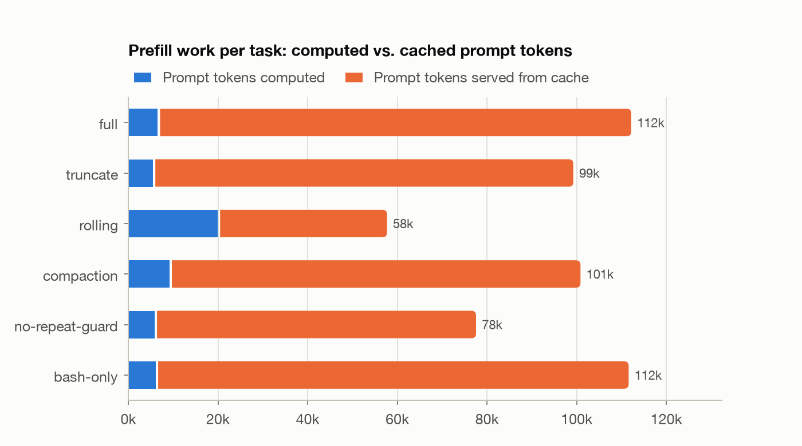
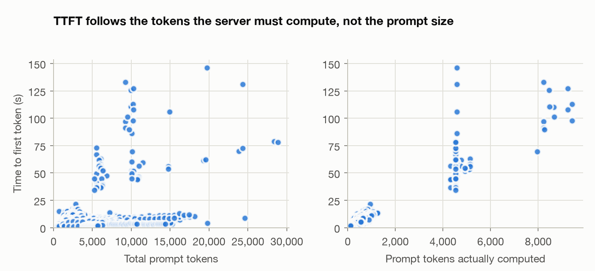
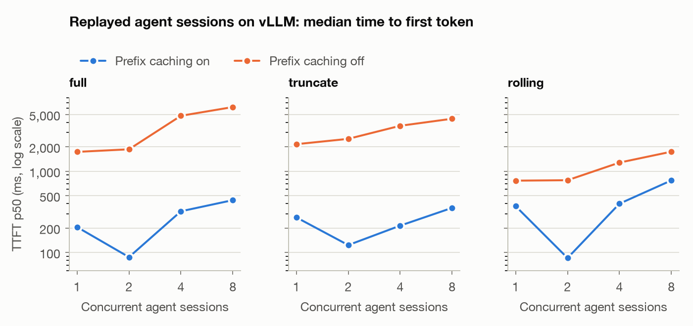
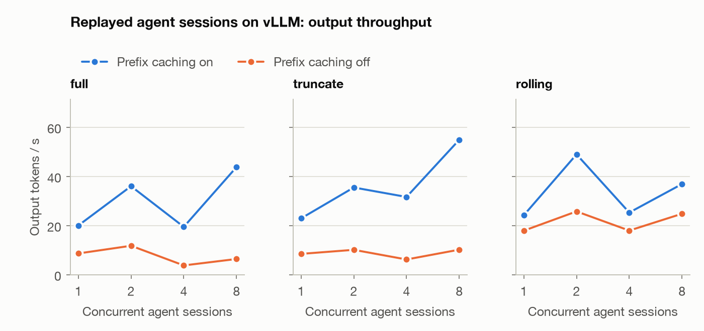

# harness-lab

A small, configurable **coding agent harness** built to measure how harness design choices
change two things at once:

1. **Task success.** Does the agent solve the task?
2. **Inference workload.** How many prompt tokens does each design send, how many of them can
   the server serve from its KV cache, and what does that do to time to first token (TTFT),
   decode time and throughput?

The harness runs as a custom agent inside [Harbor](https://github.com/harbor-framework/harbor),
the evaluation framework behind Terminal-Bench, and talks to any OpenAI-compatible endpoint.
Everything here was produced **for free**: a laptop, a free hosted-model tier, and a free
Kaggle GPU notebook.

**Headline result:** the way a harness shrinks its context decides how much work the GPU
does, and the intuitive choice is the wrong one. Showing the model only its last few tool
outputs halved the prompt (58k vs 112k tokens per task) but made the server compute **2.9×
more prefill tokens** and **doubled TTFT**, because rewriting old messages destroys the
prefix cache. Truncating each tool output once, when it is first stored, captures the token
savings and keeps the cache. Replaying the same recorded sessions against vLLM shows the
other half of that story: prefix caching is worth 8–21× on time to first token, and the
ranking of context strategies flips when the server has no cache.

## Contents

- [What the harness does](#what-the-harness-does)
- [Benchmark: py-bugfix-lite](#benchmark-py-bugfix-lite)
- [Results](#results)
- [Findings](#findings)
- [Limitations](#limitations)
- [Quick start](#quick-start)
- [Repository layout](#repository-layout)

## Why this matters

Coding agents send an unusual kind of traffic to inference servers: prompts are long and
grow every turn, outputs are short, and the GPU sits idle while tools run. A server can only
reuse cached attention state (the KV cache) for the part of a prompt that is byte-for-byte
identical to an earlier request, so a harness's context strategy directly sets how much
prefill work the hardware has to do. This project measures that end to end.

## What the harness does

```
Harbor task container (Docker)  <-- bash / view_file / edit_file / submit --
        |                                                                   |
        '-- stdout, exit code -->  harness loop  -- streamed request -->  model server
                                   (context strategy,                     (llama.cpp / vLLM /
                                    tool set, limits)                      NVIDIA API catalog)
                                        |
                                        '--> harness_trace.jsonl: per call TTFT, inter-token
                                             gaps, prompt / cached / output tokens, server
                                             prefill time, tool time
```

The settings under study ([`configs/`](configs)):

| Variant | Context strategy | Effect on the server |
|---|---|---|
| `full` | Keep every message | Largest prompts; the prefix never changes, so the cache hits |
| `truncate` | Cap each tool output at 2,000 chars **when it is stored** | Smaller prompts, prefix still never changes |
| `rolling` | Show only the last 3 tool outputs, eliding older ones **on every call** | Smaller prompts, but the prefix changes each turn, so the cache misses |
| `compaction` | Summarize the history once the prompt passes ~12k tokens | One cache miss per compaction |
| `no-repeat-guard` | `full`, minus the repeated-call warning | Isolates that guard's effect |
| `bash-only` | `full`, with no view/edit tools | Tool-design ablation |

## Benchmark: py-bugfix-lite

Twelve small Python tasks in Harbor format ([`tasks/py-bugfix-lite`](tasks/py-bugfix-lite)):
off-by-one errors, LRU recency, `Decimal` money math, deep-merge mutation, JSON-schema error
paths, a CLI feature, a noisy 4,000-line log to parse, and a 492-case test suite whose
failure output is enormous.

- The agent sees visible tests; the verifier runs **hidden** tests covering every stated
  requirement, so a partial fix scores 0.
- All tasks share two image layers, so the set costs little disk.
- `scripts/check_tasks.py` asserts that each task's tests fail on the shipped code and pass
  with the reference fix. Through Harbor, the `oracle` agent scores 1.0 and `nop` scores 0.0.

## Results

Three sets of runs. Token counts and cache hit rates are hardware-independent; latencies are
specific to the machine named in each section.

### 1. Local: Qwen3-8B (4-bit) on an Apple M4, llama.cpp

24 attempts per variant (12 tasks × 2 trials), one task at a time, single server slot.

| Variant | Pass rate (95% CI) | Prompt tok / task | Prefill computed / task | Cache hit | Output tok / task | TTFT p50 / p90 | Median task time |
|---|---|---|---|---|---|---|---|
| `full` | 1/24 = 4% (1–20%) | 112,174 | 7,085 | 94% | 1,051 | 3.3 s / 7.7 s | 246 s |
| `truncate` | 2/24 = 8% (2–26%) | 99,241 | **6,027** | 94% | 1,184 | 2.6 s / 6.7 s | 163 s |
| `rolling` | 0/24 = 0% (0–14%) | **57,695** | 20,481 | 65% | 1,058 | **7.3 s** / 11.8 s | 283 s |
| `compaction` | 2/24 = 8% (2–26%) | 100,844 | 9,715 | 90% | 1,198 | 2.5 s / 5.0 s | 161 s |
| `no-repeat-guard` | 1/24 = 4% (1–20%) | 77,551 | 6,398 | 92% | 1,060 | 2.1 s / 4.2 s | 146 s |
| `bash-only` | 0/24 = 0% (0–14%) | 111,594 | 6,652 | 94% | 1,050 | 2.1 s / 4.0 s | 115 s |

<picture><source media="(prefers-color-scheme: dark)" srcset="results/local-qwen3-8b/prefill_work-dark.png"></picture>

<picture><source media="(prefers-color-scheme: dark)" srcset="results/local-qwen3-8b/ttft_vs_tokens-dark.png"></picture>

Where the time went (mean seconds per task): prefill took 51% of `full`'s wall time and
**71% of `rolling`'s**, against 3–4% for tool execution.

Full tables, per-variant charts and raw CSVs: [`results/local-qwen3-8b`](results/local-qwen3-8b).

### 2. Hosted: Nemotron 3 Super on the NVIDIA API catalog

The same harness and tasks against a much stronger reasoning model, one trial per variant
(free tier; 12 tasks each).

| Variant | Pass rate (95% CI) | Median steps | Prompt tok / task | Output tok / task | Median task time |
|---|---|---|---|---|---|
| `full` | 10/12 = 83% (55–95%) | 22 | 95,681 | 12,582 | 141 s |
| `truncate` | **12/12 = 100%** (76–100%) | 17 | **60,472** | 9,930 | 139 s |
| `rolling` | 11/12 = 92% (65–99%) | **30** (hit the step limit on 7 tasks) | 70,414 | 12,506 | 229 s |
| `compaction` | 11/12 = 92% (65–99%) | 14 | 51,995 | 8,725 | 125 s |

This workload looks completely different from the local one: **decode is 85–88% of wall time**
(prefill 9–12%), and the input:output token ratio is 6.4:1 instead of 80.7:1, because the
model emits long reasoning on every turn.

Charts and CSVs: [`results/nim-nemotron-3-super`](results/nim-nemotron-3-super).

### 3. Replay on a real NVIDIA GPU: vLLM on a free Kaggle T4

Each trace records, per model call, the prompt length, how much of the prompt the server
reused from the previous call, the output length, and the gap while tools ran.
`harness_lab.replay` rebuilds those sessions as synthetic token-ID prompts with the same
prefix structure and sends many at once to vLLM, so one recorded workload can be pointed at
different serving configurations.

70 recorded sessions, Qwen3-1.7B on a T4 (float16, eager, 32k context), 1–8 concurrent
sessions, prefix caching on and then off. TTFT is the median; ratio is off ÷ on.

| Variant | Sessions | TTFT on | TTFT off | Ratio | Output tok/s on / off | ITL p99 on / off | vLLM hit rate |
|---|---|---|---|---|---|---|---|
| `full` | 1 | 206 ms | 1,734 ms | 8.4× | 20.0 / 8.7 | 42 / 43 ms | 93% |
| `full` | 2 | **88 ms** | 1,866 ms | **21×** | 36.0 / 11.8 | 49 / 911 ms | 98% |
| `full` | 4 | 322 ms | 4,826 ms | 15× | 19.5 / 3.8 | 670 / 7,403 ms | 94% |
| `full` | 8 | 441 ms | 6,184 ms | 14× | 43.8 / 6.4 | 691 / 7,939 ms | 97% |
| `truncate` | 1 | 270 ms | 2,157 ms | 8.0× | 22.9 / 8.5 | 42 / 42 ms | 94% |
| `truncate` | 2 | 123 ms | 2,509 ms | 20× | 35.5 / 10.1 | 51 / 1,405 ms | 98% |
| `truncate` | 4 | 214 ms | 3,635 ms | 17× | 31.7 / 6.2 | 192 / 2,665 ms | 96% |
| `truncate` | 8 | **354 ms** | 4,439 ms | 12.5× | **54.9** / 10.2 | 415 / 5,873 ms | 97% |
| `rolling` | 1 | 372 ms | 767 ms | 2.1× | 24.2 / 17.9 | 32 / 33 ms | 71% |
| `rolling` | 2 | 85 ms | 776 ms | 9.1× | 49.0 / 25.8 | 40 / 703 ms | 91% |
| `rolling` | 4 | 399 ms | 1,280 ms | 3.2× | 25.3 / 18.0 | 1,445 / 2,169 ms | 66% |
| `rolling` | 8 | 772 ms | **1,744 ms** | 2.3× | 36.9 / 24.8 | 2,433 / 2,183 ms | 65% |

<picture><source media="(prefers-color-scheme: dark)" srcset="results/replay-kaggle-t4/replay_ttft-dark.png"></picture>

<picture><source media="(prefers-color-scheme: dark)" srcset="results/replay-kaggle-t4/replay_throughput-dark.png"></picture>

Two things stand out. First, vLLM's measured hit rate tracks the prefix reuse recorded in the
traces (93–98% for `full` and `truncate`, 65–71% for `rolling`), which is the check that the
replay reproduces real agent traffic rather than a synthetic guess. Second, **the ranking of
context strategies flips with the server's cache**: with prefix caching on, `rolling` has the
worst TTFT at 8 sessions (772 ms vs 354 ms for `truncate`); with caching off, `rolling` has
the best (1,744 ms vs 6,184 ms for `full`), because all it can do is send fewer tokens.

Without caching, long prefills also block other requests' decoding: inter-token latency p99
at 8 concurrent `full` sessions is 7.9 s, against 0.69 s with caching.

[`results/replay-kaggle-t4`](results/replay-kaggle-t4) (a 5-session pilot is in
[`results/replay-kaggle-t4-smoke`](results/replay-kaggle-t4-smoke)) ·
notebook generator: [`serving/make_kaggle_notebook.py`](serving/make_kaggle_notebook.py) ·
Modal variant (needs a card on file): [`serving/modal_replay.py`](serving/modal_replay.py)

## Findings

1. **Coding agent traffic is prompt-dominated and highly cacheable.** With full history, one
   task sent 112k prompt tokens and 1.05k output tokens (81:1), and 94% of the prompt tokens
   were served from cache. Only 7.1k tokens per task actually had to be prefilled.
2. **Shrinking the prompt the wrong way makes the GPU do more work.** `rolling` sent 49% fewer
   prompt tokens than `full` but computed 2.9× more of them (20.5k vs 7.1k), with a 65% hit
   rate instead of 94%, a 2.2× worse TTFT p50, and 71% of its wall time in prefill. Any
   context strategy that rewrites earlier messages pays for the whole suffix again.
3. **Insert-time truncation is the strategy that wins on both axes.** It keeps the prefix
   stable, so it had the lowest prefill work of any variant (6.0k tokens per task) and, with
   the strong model, the best pass rate (12/12) with 37% fewer prompt tokens than `full`.
4. **Prefix caching is worth 8–21× TTFT on real hardware.** Replaying the recorded sessions on
   a T4 with vLLM, turning prefix caching off raised median TTFT for `full` from 88 ms to
   1.9 s at 2 concurrent sessions and from 441 ms to 6.2 s at 8, cut output throughput to a
   seventh, and pushed inter-token latency p99 from 0.69 s to 7.9 s as long prefills blocked
   other sessions' decoding.
5. **The best context strategy depends on the serving stack.** With prefix caching on,
   `rolling` had the worst TTFT at 8 sessions (772 ms vs 354 ms for `truncate`). With caching
   off, it had the best (1.7 s vs 6.2 s for `full`), because sending fewer tokens is the only
   lever left. A harness tuned against a cacheless endpoint is mistuned for vLLM, and vice
   versa.
6. **Which resource an agent stresses depends on the model, not just the harness.** The same
   harness and tasks were prefill-bound on a local 8B model (51–71% of time in prefill) and
   decode-bound on a hosted reasoning model (85–88% in decode). A harness tuned for one is
   mistuned for the other.
7. **A plausible harness guard did nothing (negative result).** Qwen3-8B kept repeating
   identical tool calls, so the harness began warning it on repeats. The warning fired 15
   times per run on average but pass rate stayed at 1/24; runs simply got longer (24.6 vs 21.3
   tool calls) and therefore sent 45% more cumulative prompt tokens. Repeated calls fell only
   from 60% to 50% of all calls.
8. **Tool design changed behavior, not the inference profile.** Dropping the structured
   `view_file`/`edit_file` tools and leaving only `bash` left the workload essentially
   unchanged (112k prompt tokens per task, 94% cache hit) but the agent reached a `submit`
   call in only 2 of 24 runs, against 7 of 24 with edit tools, and solved none. It also made
   more tool calls per run (28.5 vs 24.6). Tool design is a task-success lever here, not a
   token lever.
9. **A hosted free tier needed retries on a fifth of its calls.** 242 of 1,195 requests to the
   API catalog returned a mid-stream "overloaded" error; every one succeeded on retry. An
   agent harness without in-stream retry logic would have failed those tasks.

### What this suggests for inference systems

- Cache hit rate, not prompt length, is the metric an agent harness should optimize; a
  "context saving" that breaks the prefix is a regression in GPU work.
- Tool execution left the GPU idle only 3–4% of the time here, but that idle time still holds
  KV cache. The largest single context in these runs was 24.6k tokens, which for a 70B-class
  model (80 layers, 8 KV heads, head dim 128, FP16) is about 7.5 GiB of KV cache for one
  agent, so retention policy matters as soon as several agents run at once.
- Reasoning models move agent traffic from prefill-bound to decode-bound, which changes what
  hardware and batching policy suit them.

## Limitations

- **One benchmark, 12 tasks, small models.** Qwen3-8B at 4-bit solves almost none of these
  tasks (0–8%), so the local pass rates cannot separate variants; they are reported for
  honesty, and the variant comparison on success rests on the single-trial Nemotron runs.
- **Latencies are machine-specific.** The M4 numbers come from a 16 GB laptop that was also
  running Docker and was memory-constrained (~9 GB of swap in use). Two trials were
  interrupted by system sleep; they keep their pass/fail and token counts but are excluded
  from every timing statistic (`report.py` flags them automatically).
- **The hosted numbers include network and queueing**, and that provider reported cached-token
  counts inconsistently (12% for `full`, ~0% for the others), so its cache behavior can't be
  read from them.
- **The replay is synthetic in content, faithful in shape.** It reproduces prompt lengths,
  prefix overlap, output lengths and inter-call gaps with random token IDs; it does not
  reproduce attention patterns of real text. Sessions recorded across a machine sleep are
  dropped and remaining gaps are capped at 120 s, so one stalled tool call cannot distort a
  replay.
- **The GPU numbers are from a T4** (float16, eager mode, Triton attention backend) with a
  1.7B model, because that is what a free Kaggle notebook provides. The direction of the
  effects should hold on datacenter GPUs; the absolute latencies will not.
- **Single trial for the hosted model** (free-tier credits), so those pass rates have wide
  confidence intervals.
- **Not yet run on Terminal-Bench.** The harness implements Harbor's external-agent interface,
  so a `--dataset terminal-bench@2.0` run is one flag away, but those task images need more
  free disk than this laptop had (13 GB). Only `py-bugfix-lite` results are reported here.

## Quick start

Requirements: macOS or Linux, Docker, [uv](https://docs.astral.sh/uv/),
[llama.cpp](https://github.com/ggml-org/llama.cpp) (`brew install uv llama.cpp`).

```bash
uv sync --extra analysis

# 1. Model: Qwen3-8B, 4-bit GGUF (5.0 GB)
mkdir -p ~/models
curl -L -o ~/models/Qwen3-8B-Q4_K_M.gguf \
  https://huggingface.co/Qwen/Qwen3-8B-GGUF/resolve/main/Qwen3-8B-Q4_K_M.gguf

# 2. Serve it (OpenAI-compatible API on :8080)
scripts/serve_local.sh

# 3. Check everything, then run one task
uv run pytest -q                        # 35 unit tests, no network
uv run python scripts/check_tasks.py    # tasks fail before the fix, pass after
uv run harbor run -p tasks/py-bugfix-lite -i csv-report-totals \
  -a harness_lab.harbor_agent:HarnessLabAgent -m local/qwen3-8b \
  --ak config=configs/full.yaml -n 1

# 4. Run the grid and build the report
scripts/run_matrix.sh                   # ~55 min per variant-trial on an M4
uv run --extra analysis python analysis/report.py jobs/exp-* --out results/local-qwen3-8b
```

Hosted models: copy `.env.example` to `.env`, add `NVIDIA_API_KEY`, then

```bash
MODEL=nvidia/nvidia/nemotron-3-super-120b-a12b CONFIG_DIR=configs/nim PREFIX=nim TRIALS=1 scripts/run_matrix.sh
```

GPU replay, free on Kaggle (needs a phone-verified account):

```bash
uv run python -m harness_lab.replay export jobs/exp-* --out traces/sessions.jsonl
uv run python serving/make_kaggle_notebook.py traces/sessions.jsonl --out ~/Downloads/replay.ipynb
```

Import that notebook on Kaggle with **GPU T4 x2** and **Internet on**, run it, and download
`replay-results.zip`; or push it with the Kaggle CLI (`kaggle kernels push`). Then:

```bash
uv run --extra analysis python analysis/replay_report.py results/replay-kaggle-t4
```

### Why Qwen3-8B

It is a standard transformer: every layer uses full attention, so its prefix-cache behavior
matches the datacenter models this project is about. Newer small models such as Qwen3.5 mix
linear-attention layers into the stack, which changes how prefix caching works.

## Measurement notes

- **TTFT and inter-token gaps** are measured client-side from the streamed response; llama.cpp
  also reports its own prompt-processing time and per-token decode time, and the analysis
  prefers those server numbers where they exist.
- **Cached tokens** come from `usage.prompt_tokens_details.cached_tokens`, falling back to
  llama.cpp's `timings.cache_n`. "Prefill computed" is prompt tokens minus cached tokens.
- **Server settings:** the local server runs a single slot with no host-RAM prompt cache
  ([`scripts/serve_local.sh`](scripts/serve_local.sh)), so the only cache in play is that
  slot's KV cache.
- **Controls:** variants are interleaved trial by trial, one task at a time; every trace
  records the harness git commit, model, endpoint and full config.

## Repository layout

```
src/harness_lab/   loop.py (agent loop)   llm.py (streaming client + timing)
                   context.py (strategies)   tools.py   tracing.py
                   harbor_agent.py   replay.py (session export + vLLM replay)
configs/           one YAML per variant; configs/nim/ for the hosted model
tasks/             py-bugfix-lite (generated by scripts/make_py_bugfix_lite.py)
scripts/           serve_local.sh   run_matrix.sh   check_tasks.py
serving/           make_kaggle_notebook.py (free T4)   modal_replay.py (L4)
analysis/          report.py (tables + charts)   replay_report.py
results/           committed results for each run
tests/             35 unit tests (fake model and executor; no network)
```
